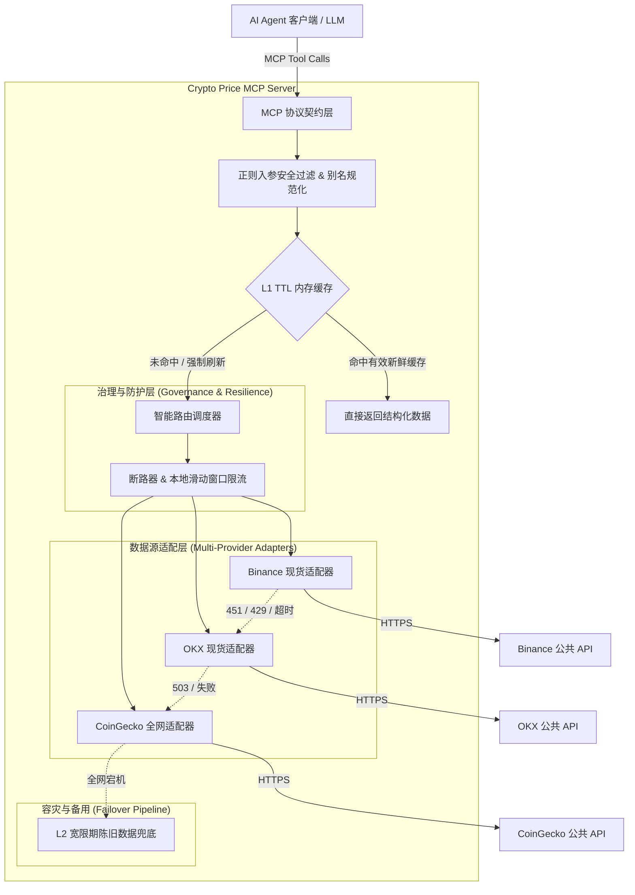

# Crypto MCP (Model Context Protocol) 服务

> 专为 AI Agent（大模型智能体）量身定制的高可用、多源容灾、金融级精度的加密货币（Crypto）行情查询 MCP 服务。

[](https://www.python.org/)
[](https://modelcontextprotocol.io/)
[](LICENSE)
[](tests/)

---

## 📖 项目背景与痛点解决

普通的加密货币 API 接口主要是为人设计的，直接给 AI Agent 使用时往往存在诸多严重痛点：

1. **单点故障与地域限制**：很多公共交易所接口（如 Binance）在部分国家或网络节点有地域限制（如 HTTP 451/503），单源架构极易造成 Agent 整个推理任务中断。
2. **微小代币科学计数法导致大模型幻觉**：Meme 币或长尾代币（如 PEPE `$0.0000084321`）在常规序列化时常被转换为 `8.4321e-06`，大模型极易看错数量级（少算或多算一个 0）。
3. **Agent 思考链（CoT）重复查询触发频控**：Agent 在多轮规划中频繁查询同币种，极易触发上游 IP 频控（HTTP 429）。
4. **Token 上下文浪费**：很多接口返回几十上百档盘口和冗余信息，一次调用就吃掉几千 Token。
5. **stdio 协议污染崩溃**：在 stdio 传输模式下，随意 `print` 任何日志都会破坏 JSON-RPC 通信流，导致客户端强行断开。

**Crypto MCP** 针对以上痛点进行了全方位的深度架构设计与优化。

---

## 🌟 核心特性

- 🔄 **多源主备与平滑容灾 (Automated Failover)**
  - **Tier 1（主流极速）**：直连 **Binance**（毫秒级现货盘口，免 API Key）。
  - **Tier 2（主流热备）**：**OKX** 公开行情热备。
  - **Tier 3（长尾托底）**：**CoinGecko**（覆盖全网 15,000+ 代币、DEX 新币与数十种法币直接换算）。
  - 遇到网络波动、超时或 429/451/503 错误，系统**毫秒级无感降级**至下一数据源，保障 Agent 永不阻断。

- ⚡ **双级缓存与陈旧兜底 (Dual-Tier Cache)**
  - **L1 新鲜缓存（Fresh TTL: 10s）**：Agent 多步推理中重复问同一币种直接从内存毫秒级返回，彻底杜绝上游限流。支持 `force_refresh: true` 穿透获取最新数据。
  - **L2 宽限期兜底（Stale Buffer: 5分钟）**：当遭遇极端网络分区或上游全挂时，系统返回最近一次有效快照并显式标记 `stale: true` 及告警信息，避免抛错崩溃。

- 🎯 **金融级精度与防科学计数法 (Financial Precision)**
  - 微小代币统一采用无损定点字符串 `price_str` 格式化，彻底规避 `8.43e-6` 等科学计数法；
  - 资产换算（`convert_crypto`）内部严格采用 `Decimal` 定点数学计算，杜绝常规浮点数（float）累加误差。

- 📦 **Token 经济学与批量查询 (Token Economics)**
  - 剥离所有沉余数据，将单次响应严格压缩在最小有效上下文（Minimal Viable Context）内；
  - 提供 `batch_crypto_prices` 并发批查询工具（单次最高 20 币种），多币对比场景一次搞定，节约 60%+ 的 Token 和网络往返耗时。

- 🛡️ **严格只读沙箱与防注入安全 (Security Sandbox)**
  - **绝对只读**：不包含任何交易、转账、签名或私钥相关接口，从根源规避 Prompt 注入引发的越权交易；
  - **参数白名单正则清洗**：输入严格限制字符集（`^[a-zA-Z0-9\-_]{1,20}$`），防范 SSRF 与路径探测。

- 📡 **纯净协议通道与可观测性 (Protocol Purity)**
  - 所有的内部日志、网络告警和熔断信息**严格定向至 `sys.stderr`**，保证 `sys.stdout` 的 JSON-RPC 数据流 100% 纯净合规。

---

## 🏗️ 系统架构图



---

## 🛠️ MCP 工具契约说明

服务向 Agent 暴露 4 个标准 MCP Tools：

### 1. `get_crypto_price`
**功能**：快速获取单个代币的实时现货价格。
- **入参**：
  - `symbol` (str, 必填)：代币代码或名称，支持常见别名（如 `BTC`, `bitcoin`, `ETH`, `SOL`, `PEPE`）。
  - `vs_currency` (str, 可选，默认 `"USD"`)：计价货币，支持 `USD`, `CNY`, `EUR`, `USDT` 等。
  - `force_refresh` (bool, 可选，默认 `false`)：是否强制穿透缓存获取最新数据。
- **返回示例**：
```json
{
  "success": true,
  "data": {
    "symbol": "BTC",
    "vs_currency": "USD",
    "price": 76406.0,
    "price_str": "76406.0",
    "display_price": "$76,406.00",
    "metadata": {
      "source": "coingecko",
      "market_type": "aggregated_dex_cex",
      "cached": false,
      "stale": false,
      "data_timestamp": "2026-09-17T11:07:33.123456+00:00",
      "latency_ms": 115
    }
  }
}
```

### 2. `get_crypto_market_data`
**功能**：获取代币 24 小时综合统计行情（包含最高、最低价、成交量、24h 涨跌幅）。
- **入参**：
  - `symbol` (str, 必填)：代币代码。
  - `vs_currency` (str, 可选，默认 `"USD"`)：计价货币。
  - `force_refresh` (bool, 可选，默认 `false`)。

### 3. `batch_crypto_prices`
**功能**：一次性并发查询多个代币的实时价格，单次往返，大幅节省 Agent 多步推理耗时与 Token。
- **入参**：
  - `symbols` (list[str], 必填)：代币代码数组（最多 20 个）。
  - `vs_currency` (str, 可选，默认 `"USD"`)。

### 4. `convert_crypto`
**功能**：使用金融级 Decimal 定点数学计算资产之间的精准换算与汇率比值，杜绝大模型浮点计算误差。
- **入参**：
  - `amount` (float, 必填)：待换算数量（如 `2.5`）。
  - `from_coin` (str, 必填)：原始资产符号（如 `BTC`, `ETH`）。
  - `to_coin` (str, 必填)：目标资产符号（如 `SOL`, `USD`）。

---

## 🚀 客户端配置与使用指南

前提条件：确保系统已安装 [`uv`](https://docs.astral.sh/uv/)（macOS / Linux 一键安装：`curl -LsSf https://astral.sh/uv/install.sh | sh`）。

### 方式一：直接通过 GitHub 运行（最推荐，无需手动 clone 和配置环境）

在 Claude Desktop、Cursor 或 Antigravity IDE 中，直接通过 `uvx` 运行 GitHub 仓库发布的包：

#### 1. Claude Desktop 客户端配置
在配置文件 `~/Library/Application Support/Claude/claude_desktop_config.json`（macOS）中添加：

```json
{
  "mcpServers": {
    "crypto-mcp": {
      "command": "uvx",
      "args": [
        "--from",
        "git+https://github.com/<your-username>/crypto-mcp.git",
        "crypto-mcp"
      ]
    }
  }
}
```

#### 2. Cursor / Antigravity IDE 配置
在 IDE 的 MCP 设置项中增加 `stdio` 服务：
- **Name**: `crypto-mcp`
- **Command**: `uvx`
- **Args**: `["--from", "git+https://github.com/<your-username>/crypto-mcp.git", "crypto-mcp"]`

---

### 方式二：本地克隆运行（适合二次开发）

如果你克隆了本项目源码并进行了本地调试：

```json
{
  "mcpServers": {
    "crypto-mcp": {
      "command": "uv",
      "args": [
        "--directory",
        "/path/to/crypto_mcp",
        "run",
        "crypto-mcp"
      ]
    }
  }
}
```

> **注意**：请将 `/path/to/crypto_mcp` 替换为你实际克隆到本地的代码目录绝对路径。

---

### 3. 官方 MCP Inspector 可视化调试
若需在浏览器中实时调试工具协议：
```bash
# 本地源码调试
npx @modelcontextprotocol/inspector uv run crypto-mcp
```
终端会输出调试网页链接，浏览器打开后即可在图形界面直接调用 4 个 Tool 并查看实时报文。

---

## 💬 AI Agent 典型交互示例

成功接入 MCP 后，你可以直接在聊天框中向 AI 发送以下 Prompt 进行测试：

| 测试意图 | 建议测试 Prompt | Agent 触发工具 |
| :--- | :--- | :--- |
| **基础查价与别名映射** | “现在比特币和以太坊的价格是多少？” | `batch_crypto_prices` 或 `get_crypto_price` |
| **24h 涨跌对比** | “帮我查下 BTC、ETH 和 SOL 今天谁涨幅最高，分别涨跌了多少？” | `get_crypto_market_data` |
| **微小代币精度测试** | “PEPE 现在的单价是多少？不要用科学计数法展示。” | `get_crypto_price(symbol="PEPE")` |
| **高精度资产折算** | “如果我持有 3.5 个以太坊，按照现在的市价能换多少个 SOL？” | `convert_crypto` |
| **法币计价查询** | “帮我以人民币（CNY）为单位查询一下 1 个 BTC 的价格。” | `get_crypto_price(symbol="BTC", vs_currency="CNY")` |

---

## 🧪 测试与开发指南

本项目基于 `uv` 包管理器构建，包含全套单元测试与集成测试矩阵。

### 运行自动化测试
```bash
uv run pytest -v
```
测试矩阵覆盖：
- `test_precision.py`：微小代币非科学计数法格式化、Decimal 换算；
- `test_normalizer.py`：输入安全正则清洗、别名归一化、防注入验证；
- `test_cache_and_circuit.py`：L1 缓存有效性、L2 陈旧兜底、断路器熔断与限流；
- `test_providers.py`：Mock HTTP 验证 Binance、OKX、CoinGecko 适配器解析；
- `test_aggregator.py`：故障转移平滑降级、并发批查询；
- `test_server.py`：MCP 协议工具注册与调用端到端测试。

### 运行公网真实网络探活
```bash
uv run python -c "
import asyncio
from crypto_mcp.aggregator import CryptoPriceAggregator

async def main():
    agg = CryptoPriceAggregator()
    for coin in ['BTC', 'ETH', 'PEPE']:
        p = await agg.get_price(coin, 'USD')
        print(f'[{coin}] 价格: {p.display_price} | 原始高精度: {p.price_str} | 数据源: {p.metadata.source}')

asyncio.run(main())
"
```

---

## 📂 代码目录结构

```
crypto_mcp/
├── pyproject.toml              # 项目依赖与打包元数据 (uv / hatchling)
├── README.md                   # 详细中文说明文档
├── AGENTS.md                   # Agent 开发与测试红线规范
├── src/
│   └── crypto_mcp/
│       ├── __init__.py         # 包版本定义
│       ├── __main__.py         # python -m crypto_mcp 入口
│       ├── server.py           # MCP Server 服务定义与 4 项 Tools 注册
│       ├── models.py           # Pydantic v2 数据模型与统一响应信封
│       ├── aggregator.py       # 价格聚合、分级路由与多源故障转移调度引擎
│       ├── governance/
│       │   ├── cache.py        # L1 新鲜缓存 + L2 宽限期陈旧兜底缓存
│       │   └── circuit_breaker.py # 断路器 (Circuit Breaker) 与滑动窗口限流器
│       ├── providers/
│       │   ├── base.py         # BasePriceProvider 统一抽象基类
│       │   ├── binance.py      # 币安公开行情适配器
│       │   ├── okx.py          # 欧易公开行情适配器
│       │   └── coingecko.py    # CoinGecko 全网聚合行情适配器
│       └── utils/
│           ├── precision.py    # 金融级精度控制、Decimal计算、规避科学计数法
│           ├── normalizer.py   # 符号归一化、代币别名消歧与输入防注入清洗
│           └── logging.py      # Stderr 专属纯净日志（严禁污染 stdout）
└── tests/                      # 32 项自动化测试套件
    ├── test_precision.py
    ├── test_normalizer.py
    ├── test_cache_and_circuit.py
    ├── test_providers.py
    ├── test_aggregator.py
    └── test_server.py
```

---

## ⚖️ 免责声明 (Disclaimer)

- 本 MCP 服务提供的数据来源于第三方交易所及公开行情聚合平台，仅用于 AI Agent 的辅助信息检索与参考；
- 本服务严格遵循只读原则，**不构成任何投资建议**，亦不具备任何直接资金交易功能。
